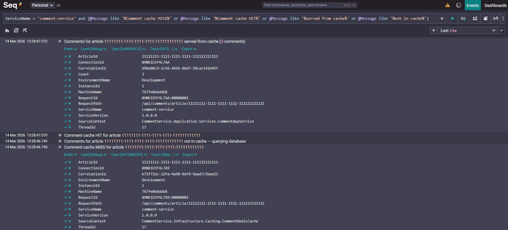
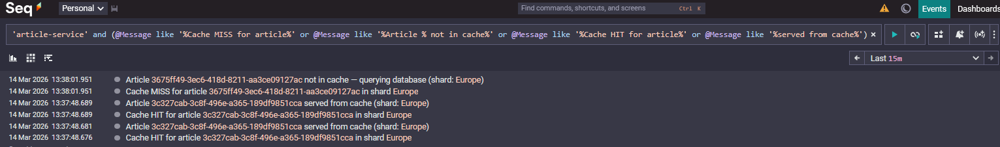
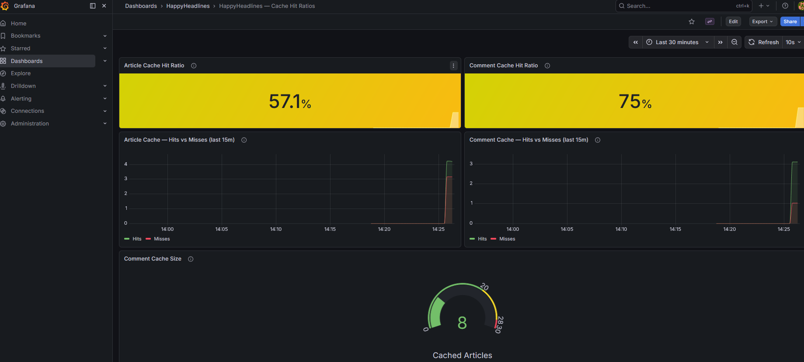

# HappyHeadlines

A scalable, microservice-based article platform built with .NET 10.0 and Clean Architecture principles. Demonstrates geographical sharding, independent microservices, containerization, and centralized observability.

## Scalability Patterns

- **X-Axis (Horizontal Duplication)**: Multiple API instances per service behind an Nginx load balancer. ArticleService: ports 8081–8083. DraftService: ports 8084–8086.
- **Y-Axis (Functional Decomposition)**: `ArticleService` handles published articles and comments. `DraftService` handles author drafts. Each has its own database, Dockerfile, and deployment lifecycle.
- **Z-Axis (Data Partitioning)**: Articles are sharded across 8 continent-based PostgreSQL databases for data locality and regional scaling.

## 🚀 Features

- **Geographical Sharding**: Articles distributed across 8 continent-based PostgreSQL shards
- **Independent Microservices**: ArticleService and DraftService with separate DBs and containers
- **Clean Architecture**: Domain / Application / Infrastructure / API layers enforced by project boundaries
- **Centralized Observability**: Shared `HappyHeadlines.Observability` library wires Serilog + OpenTelemetry into any service with one method call
- **Structured Logging + Tracing**: Seq aggregates logs and traces from all services with automatic retention and sensitive data scrubbing
- **Correlation ID**: Every request carries an `X-Correlation-ID` header threaded through all log events and trace spans
- **Containerization**: Full Docker Compose stack started with one command
- **Load Balancing**: Nginx with separate upstreams for each service
- **API Documentation**: Scalar/OpenAPI available on each service in development

## 🏗️ Architecture

```md
client → nginx :5000
           ├── /api/drafts → draft-api-1/2/3   (DraftService DB :5442)
           └── /           → article-api-1/2/3  (8 shard DBs :5432-5439, comments :5440, profanity :5441)
                                     ↓
                               Seq :5380 (logs + traces from all services)
```

### Shared Observability Library (`src/Shared/HappyHeadlines.Observability`)

Single library consumed by every service. Exposes two extension methods:

- `builder.AddHappyHeadlinesObservability("service-name")` — wires Serilog + OpenTelemetry
- `app.UseHappyHeadlinesObservability()` — registers CorrelationId middleware + request logging

### ArticleService (`src/ArticleService`)

| Layer | Project | Responsibility |
| --- | --- | --- |
| Domain | `ArticleService.Domain` | Article, Comment, ProfaneWord entities |
| Application | `ArticleService.Application` | Services, interfaces, DTOs, circuit breaker |
| Infrastructure | `ArticleService.Infrastructure` | EF Core, repositories, continent shard router |
| API | `ArticleService.Api` | Minimal API endpoints, DI wiring |

**Databases:** 8 continent shards (ports 5432–5439), Comments DB (5440), Profanity DB (5441)

### DraftService (`src/DraftService`)

| Layer | Project | Responsibility |
| --- | --- | --- |
| Domain | `DraftService.Domain` | Draft entity |
| Application | `DraftService.Application` | DraftAppService, IDraftRepository, DTOs, Result\<T\> |
| Infrastructure | `DraftService.Infrastructure` | EF Core DbContext, DraftRepository |
| API | `DraftService.Api` | Minimal API endpoints, DI wiring |

**Database:** Single drafts DB (port 5442)

## 🛠️ Technologies

- **Backend**: .NET 10.0, ASP.NET Core Minimal APIs
- **Database**: PostgreSQL 16 with Entity Framework Core (Npgsql)
- **Logging / Tracing**: Serilog, OpenTelemetry (OTLP), Seq
- **Containerization**: Docker, Docker Compose
- **Load Balancing**: Nginx
- **Documentation**: Scalar/OpenAPI

## 🐳 Running the Stack

```bash
docker-compose up --build -d
```

| Container | Purpose | Port |
| --- | --- | --- |
| `nginx` | Load balancer entry point | 5000 |
| `article-api-1/2/3` | ArticleService replicas | 8081–8083 |
| `draft-api-1/2/3` | DraftService replicas | 8084–8086 |
| `seq` | Log & trace UI | 5380 (UI), 5341 (ingest) |
| `db-africa` … `db-global` | Article continent shards | 5432–5439 |
| `db-comment` | Comments database | 5440 |
| `db-profanity` | Profanity filter database | 5441 |
| `db-draft` | Drafts database | 5442 |

### Local Development

Start only infrastructure, then `dotnet run` the service you're working on. `appsettings.Development.json` in each service overrides all connection strings to `localhost` with the exposed Docker ports.

```bash
docker-compose up -d seq db-africa db-antarctica db-asia db-europe db-northamerica db-oceania db-southamerica db-global db-comment db-profanity db-draft
cd src/DraftService/DraftService.Api && dotnet run
```

## 📊 Observability

| URL | What you see |
| --- | --- |
| `http://localhost:5380` | Seq — all structured logs and traces from every service |
| `http://localhost:3000` | Grafana — pre-provisioned cache dashboard (`admin` / `admin`) |
| `http://localhost:8081/scalar` | ArticleService OpenAPI (replica 1) |
| `http://localhost:8084/scalar` | DraftService OpenAPI (replica 1) |

### Filtering In Seq

- `ServiceName = 'article-service'` — ArticleService events only
- `ServiceName = 'draft-service'` — DraftService events only
- `CorrelationId = '<id>'` — all events for a single request across all services

### Comment Cache MISS Then HIT

1. Call `GET /api/comments/article/{articleId}` once, then call it again.
2. In Seq, filter to CommentService and cache messages:
      `ServiceName = 'comment-service' and (@Message like '%not in cache%' or @Message like '%served from cache%' or @Message like '%Comment cache MISS%' or @Message like '%Comment cache HIT%')`
3. Expected order: first request shows MISS (`not in cache` / `Comment cache MISS`), second request shows HIT (`served from cache` / `Comment cache HIT`).



### Article Cache MISS Then HIT

1. Use two quick checks:
      - Guaranteed MISS: call `GET /api/articles/{random-guid}?continent={continent}` once.
      - Guaranteed HIT: `POST /api/articles`, then call `GET /api/articles/{createdId}?continent={continent}`.
2. In Seq, filter to ArticleService and cache messages:
      `ServiceName = 'article-service' and (@Message like '%not in cache%' or @Message like '%served from cache%' or @Message like '%Cache MISS for article%' or @Message like '%Cache HIT for article%')`
3. Expected logs:
      - MISS path: `Cache MISS for article ...` and `Article ... not in cache — querying database`.
      - HIT path: `Cache HIT for article ...` and `Article ... served from cache ...`.

Note: `POST /api/articles` writes through to Redis immediately, so a follow-up `GET` for that new article is typically a HIT.



### Grafana Cache Dashboard

1. Open `http://localhost:3000` and open the `HappyHeadlines — Cache Hit Ratios` dashboard.
2. Set the time range to `Last 15 minutes`.
3. Run a few article/comment cache requests, then refresh the dashboard to see Article/Comment hit ratio, hit vs miss counts, and Comment cache size.



Log levels: `Debug` (queries, dev only) → `Information` (business events) → `Warning` (not found, validation) → `Error` (exceptions, DB failures). Passwords, tokens, and PII are automatically redacted by `SensitivePropertyScrubber` before any log event leaves the process.

## 📚 API Endpoints

### ArticleService

Via nginx `http://localhost:5000`

| Method | Route | Description |
| --- | --- | --- |
| `POST` | `/api/articles` | Create article |
| `GET` | `/api/articles/{id}?continent={c}` | Get article by ID |
| `PUT` | `/api/articles/{id}` | Update article |
| `DELETE` | `/api/articles/{id}` | Delete article |
| `POST` | `/api/comments` | Create comment (profanity-checked) |
| `GET` | `/api/comments/{id}` | Get comment by ID |
| `GET` | `/api/articles/{id}/comments` | Get all comments for an article |
| `POST` | `/api/profanity` | Add profanity word |
| `GET` | `/api/profanity` | List all profanity words |

### DraftService

Via nginx `http://localhost:5000`

| Method | Route | Description |
| --- | --- | --- |
| `POST` | `/api/drafts` | Save new draft |
| `GET` | `/api/drafts/{id}` | Get draft by ID |
| `GET` | `/api/drafts/author/{authorId}` | Get all drafts by author |
| `PUT` | `/api/drafts/{id}` | Update draft |
| `DELETE` | `/api/drafts/{id}` | Delete draft |
